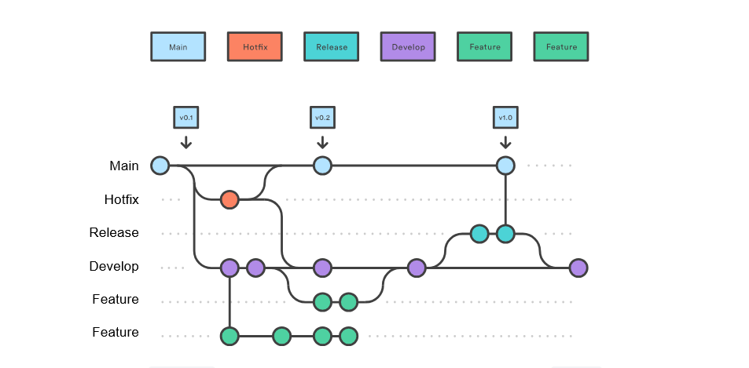

<div align=center>

# Git Workflow

_How this project does Git related activities_

</div>

## Branching

This project is using the Gitflow branching model as described by [Atlassian](https://www.atlassian.com/git/tutorials/comparing-workflows/gitflow-workflow). Refer to that article for an in-depth guide to this workflow.

### Branches Overview

- premanent branches
  - Main - production code
  - Develop - in development code
- temporary branches
  - Hotfix - fix production code
  - Release - ready code for production
  - Feature - add to codebase

### Table

> [!IMPORTANT] 
> Multiple valuse in the *Merge To* column must all be merged into at the same time

| Branch Name | Checkout To      | Merge To      |
| ----------- | ---------------- | ------------- |
| Main        | Hotfix           | -             |
| Develop     | Feature, Release | -             |
| Feature     | -                | Develop       |
| Hotfix      | -                | Main, Develop |
| Release     | -                | Main, Develop |

#### How to read the table:

Column ***Checkout To*** means we use column ***Branch Name*** to create this branch

```bash
# Branch Name = Main
# Checkout To = Hotfix
git checkout main_branch
git checkout -b hotfix_branch
```

Column ***Merge To*** means we merge column ***Branch Name*** into this branch

```bash
# Branch Name = Feature
# Merge To 	  = Develop
git checkout develop_branch
git merge feature_branch
git branch -D feature_branch
```


### Diagram

The diagram below shows how code travels between branches.

> [!NOTE]
> **Circles:** a commit
> 
> **Lines between branches:** code moving between branches via `git checkout` or `git merge`



## Commit Message

This convention is based on those described by [ConventionalCommits.org](https://www.conventionalcommits.org/en/v1.0.0/).

**Commit Structure**

<pre>
<b><a href="#types">&lt;type&gt;</a></b></font>(<b><a href="#scopes">&lt;optional scope&gt;</a></b>): <b><a href="#description">&lt;description&gt;</a></b>
<em>empty line</em>
<b><a href="#body">&lt;optional body&gt;</a></b>
<em>empty line</em>
<b><a href="#footer">&lt;optional footer&gt;</a></b>
</pre>

**Example Commit**

<pre>
docs(GIT_WORKFLOW.md): initial creation of file

document git related workflow to be more organized
</pre>

### Types & Scopes

> [!NOTE]
> Types & Scopes can be added/removed as needed. If removed, add to the second table for future reference.

Some common scope examples include:
- Component names: (header), (sidebar), (footer)
- Feature areas: (authentication), (search), (payments)
- Code layers: (api), (database), (ui)
- Modules or services: (user-service), (order-processing), (notification-system)

**Official Types and Scopes**

| Type 		 | For 																											 | Scopes						 								 	| 
| - 	 		 | - 	 																											 | -		 											 				| 
| feat 		 | add/remove new API feature 															 | ui, auth, database, api, provider	| 
| test  	 | adding/correcting tests																	 | Component/Function 								| 
| fix	 		 | API bug fix 																							 | same as 'feat'											| 
| refactor | code re(write/structure) that doesn't change API behavior | same as 'feat'											| 
| perf 		 | performance improving refactors													 | - 															| 
| style 	 | UI changes																								 | ComponentName											| 
| docs  	 | documentation markdown, doc comments											 | doc file name											| 
| chore 	 | configs, pipeline, dependencies, project version					 | type under 'For' column						| 

**Removed Types**

| Type / Scope | For | Example | Became
| -						 | - 	 | - 			 | - 

## Versioning

Learn more at [Semver.org](https://semver.org/)

### Overview

`0.0.0 = Major.Minor.Patch`

| Placement | Backwards Compatable? | Changes 
| - 									| - 										| - 
| Major 							| FALSE 								| Anything that breaks the previous version. May include Minor and Patch changes
| Minor 							| TRUE 									| New features to the public API, Tag features as deprecated, substantial new functionality in private code, refactors/improvments to private code 
| Patch 							| TRUE 									| Bug fixes, documentation 

### Major - Breaking Changes

Breaking changes for web apps include:
- URL & Routing Changes - they break bookmarks users may have saved
- Browser compatibility - New HTML/CSS features
- Features/Functionality - Removal of, or significant changes to, those users rely on
- Data Storage - changes to user data or preferences
- Data Handling - Authentication method changes or user's session handling (cookies)
- Removing 3rd Party Support - 

### Initial Version

0.1.0

Major verioning doesn't apply as breaking changes are expected during the initial (MVP) build.

Public API: Unstable

### Releasing New Version Checklist

> [!NOTE]
> Some steps only apply to versions 1.0.0 and greater

1. [ ] Create an appropriate release branch `release_<major>.<minor>.<patch>`
2. [ ] Update Version Number in package.json 
3. [ ] `pnpm build` to ensure successful build. Fix any issues.
4. [ ] `pnpm start` to run the build and test it
   1. [ ] Functionality works as intended
   2. [ ] (1.0.0+) Axe DevTools - pass full page scan in light & dark modes (remember to activate hover states and such)
   3. [ ] (1.0.0+) Chrome DevTools > Lighthouse (keep everything in green)